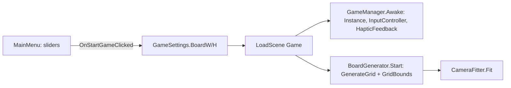

# Flows — numbered call sequences

Functions in `GameManager.cs` / `InputController.cs` unless noted.

## a) Drag-to-draw (primary)

1. `InputController.Update` reads the primary pointer (`ReadPointer`: touch if `Touchscreen.current`, else mouse).
2. **Idle → Pressed** (`TickIdle`): press over a dot (not over UI). `originPoint = hit`, highlight it.
3. **Pressed** (`TickPressed`): if released without moving → `HandleQuickTap` (tap-tap path). If moved > `dragThresholdPixels` → **Dragging**, `gm.CancelSelection()`, `gm.ShowPreview()`.
4. **Dragging** (`TickDragging` → `UpdateDrag` each frame):
   1. Finger back on `originPoint` → clear `currentTarget`, `HidePreview` (cancel; drag stays alive).
   2. Else find nearest valid adjacent dot in the snap zone (`PointInCommitZone`: progress ≥ `swipeCommitProgress` 0.9 AND perp ≤ `swipeCommitPerpTolerance` 0.3) that passes `gm.IsLegalMove` → becomes sticky `currentTarget`.
   3. Preview: solid onto `currentTarget` if any, else trails the finger (`gm.UpdatePreview`).
5. **Release** (`HandleDragRelease`) — the **only** commit point:
   1. Take `currentTarget`; if null/self, fall back to the dot under the finger if it's a legal neighbor (`ResolveReleaseTarget`).
   2. If still null/self → cancel (no line).
   3. Else `gm.TryCommitLine(origin, target)`.

## b) Tap-tap (fallback)

1. Quick tap → `HandleQuickTap` → `gm.OnPointClicked(dot)`.
2. `OnPointClicked`: guarded to one click per frame (`lastClickFrame`).
   - No selection → select dot (`firstPoint`).
   - Same dot again → deselect.
   - Different dot → clear selection, `TryCommitLine(firstPoint, dot)`.

## c) Commit line (`TryCommitLine` → `CommitLine`)

1. `TryCommitLine`: if `isGameOver` return; if `!IsLegalMove` → `LogRejection`, return false.
2. `CommitLine`:
   1. `DrawLine(a,b)` (LineRenderer, sorting order 0), `edges.Add`, `RegisterEdge` (edgeSet + adjacency).
   2. `FindAllNewClosedShapes(a,b)` → up to two bounded faces.
   3. For each face: guard `Count > 4` → skip; `EnclosesGridPoint` → skip; `Recognize == Unknown` → skip; `ShapeAlreadyClosed` → skip; else `closedShapes.Add`, `AddScore(pts)`, `ClaimRegion` (`gotShape = true`).
   4. Haptic: `VibrateShapeCreated` if `gotShape` else `VibrateLineConnected`.
   5. If `!gotShape` → `SwitchPlayer()`.
   6. If `!AnyLegalMoveRemains()` → `EndGame()`.

## d) Face tracing (`FindAllNewClosedShapes` / `TraceFace`)

1. Walk both sides of new edge (a,b): `TraceFace(b,a)` and `TraceFace(a,b)`.
2. `TraceFace(start, prev)`: at each vertex `v` arrived from `u`, take neighbor immediately **counter-index (clockwise)** in `GetSortedNeighborsByAngle(v)` — `sorted[(idx-1+n)%n]` where `idx = sorted.IndexOf(u)`. Stop when back at the directed `prev→start` edge. Guard `edges.Count*2 + 16` steps.
3. `TryAddFace`: discard if `SignedAreaGrid <= 1e-4` (outer/degenerate), if `ShapeAlreadyClosed`, or if `FacesEqual` to one already kept this move.
4. Kept faces returned to `CommitLine`.

## e) Scene boot

1. **MainMenu scene** (build 0): `MainMenu.Start` wires sliders/labels + icon buttons; `PlayerIcons.EnsureLoaded`.
2. User adjusts width/height sliders (3–10). `OnStartGameClicked` → `GameSettings.BoardWidth/Height = slider values` → `SceneManager.LoadScene("Game")`.
3. **Game scene** (build 1): `GameManager.Awake` sets `Instance`, builds `HumanPlayer`s, adds `InputController` + `HapticFeedback`. `GameManager.Start` → `EnsurePreviewLine`.
4. `BoardGenerator.Start`: reads `GameSettings`, `GenerateGrid` (dots spaced `spacing` 1.2, tagged gridX/gridY, sprite sorting order 10, sets `GridBounds`), then finds/adds `CameraFitter` and calls `Fit()`.
5. `CameraFitter.Fit` sizes/positions the orthographic camera to frame `GridBounds` inside safe area minus reserved margins; re-runs on screen change (`LateUpdate`).

